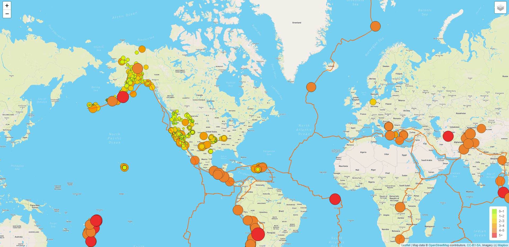
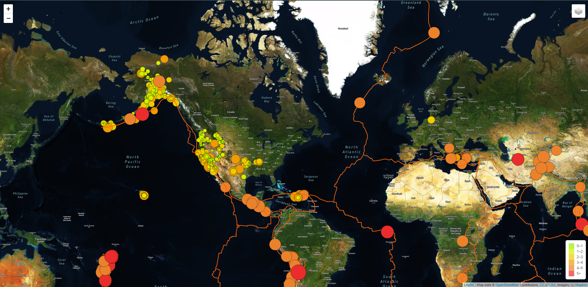
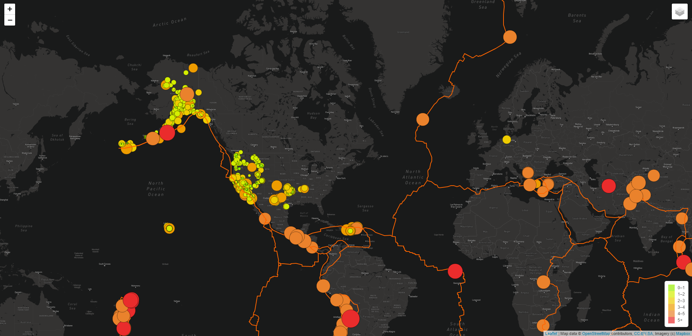

# Mapping_Earthquakes

## Objective
The purpose of this project is to visually show the differences between the magnitudes of earthquakes all over the world for the last seven days using interative map layers that also shows the tectonic plates.

## Our Interactive Map Layers
Users can change the type of layers and slo toggle the earthquake data and tectonic plates on the top right corner of the html.

### Street View

### Satellite Street View

### Dark Street View

